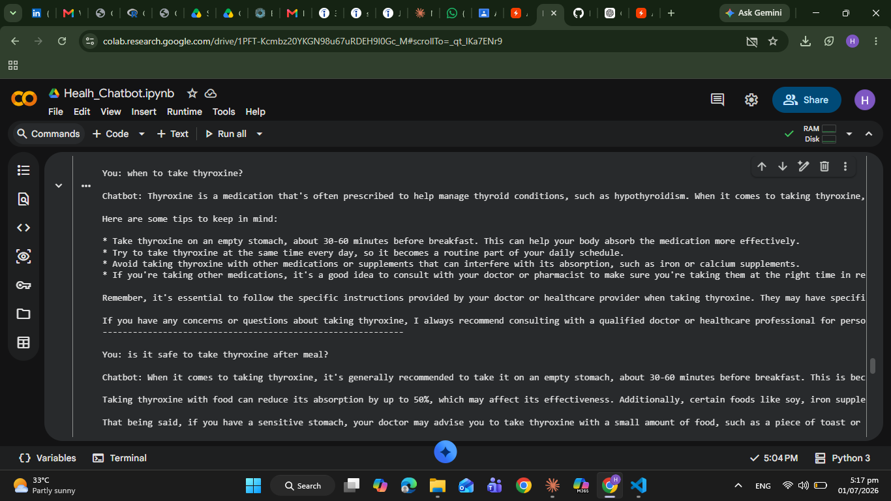

# 🩺 AI Health Query Chatbot

## Overview

The AI Health Query Chatbot is an intelligent conversational assistant developed using Python and the Groq API with the Llama 3.3 language model. It provides general health-related information while incorporating prompt engineering and safety guardrails to promote responsible AI usage.

> **Disclaimer:** This chatbot is intended for educational purposes only and should not be used as a substitute for professional medical advice.

---

## Features

- AI-powered health question answering
- Prompt engineering for clear and helpful responses
- Safety filtering for harmful or inappropriate queries
- Interactive command-line interface
- Uses Groq API with Llama 3.3

---

## Technologies Used

- Python
- Groq API
- Llama 3.3
- Prompt Engineering
- Google Colab

---

## Project Workflow

```
User Query
      │
      ▼
Safety Filter
      │
      ▼
Prompt Engineering
      │
      ▼
Groq Llama 3.3 API
      │
      ▼
AI Response
```

---

## Example

**User**

```
What are the symptoms of dehydration?
```

**Chatbot**

```
Common symptoms include increased thirst, dry mouth, dark-colored urine,
fatigue, dizziness, and headache. If symptoms become severe, seek medical care.
```

---


## Demo



---


## Future Improvements

- Streamlit Web Application
- Voice-based interaction
- Chat history
- Medical knowledge base integration
- Multilingual support

---

## Author

**Humaira Sundas**

Master's Student in Data Science | AI & Machine Learning Enthusiast
